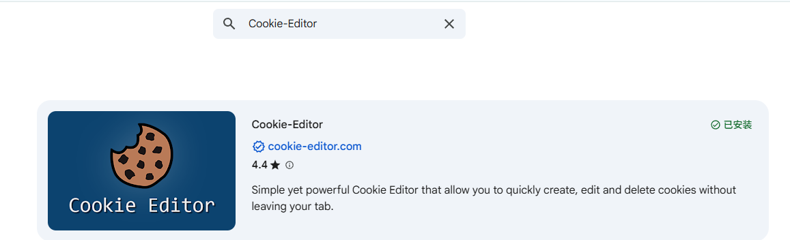
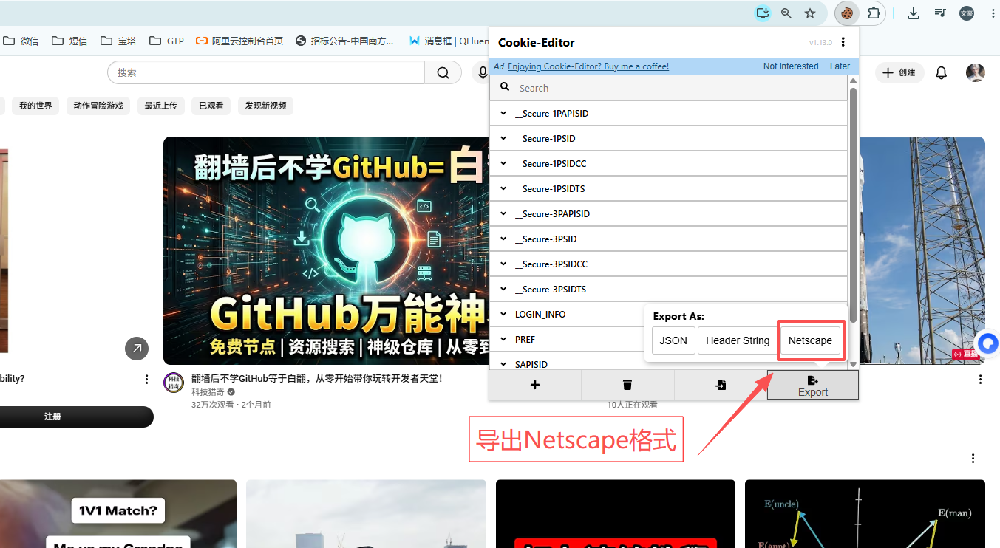

# VidLens 配置教程

三样东西：**百炼 API Key**、**YouTube Cookie**、**代理**。都可以在网页（`python app.py` → http://127.0.0.1:7860）的「🔑 凭证设置」里直接填。

---

## 一、获取 百炼 API Key（ASR / 视觉 / 总结都用它）

1. 打开 **https://bailian.console.aliyun.com/** ，用阿里云账号登录（没有就用支付宝/手机号免费注册）。
2. 首次进入会提示**开通「阿里云百炼」服务**，点同意开通（有免费额度，新用户通常送上百万 tokens）。
3. 右上角头像旁 → **API-KEY**（或左侧「API-KEY 管理」）→ **创建我的 API-KEY**。
4. 复制以 **`sk-`** 开头的字符串，填进网页「百炼 API Key」框，勾「记住」。

> 费用：通义千问总结 + Paraformer 语音识别都很便宜，先用免费额度即可，超出按量计费（一个长视频通常几分到几毛钱）。

---

## 二、获取 YouTube Cookie（绕过「确认你不是机器人」反爬）

1. 给浏览器装扩展 **Cookie-Editor**（Chrome 应用商店 / Edge 加载项搜 `Cookie-Editor`，免费）。

   

2. 浏览器打开并**登录 youtube.com**。
3. 在 youtube.com 页面点右上角 **Cookie-Editor 图标** → 右下 **Export（导出）** → 选 **Netscape** 格式（自动复制到剪贴板）。

   

4. 回到 VidLens 网页，粘贴到左侧「YouTube Cookie」框 → 点 **💾 保存设置**（看到"✅ 已保存"即成功）。

> ⚠️ Cookie = 账号登录凭证，**请勿外泄**。只保存在本机 `cookies.txt`（已在 .gitignore）。Cookie 会过期（数周~数月），失效后重新导出粘贴即可。

---

## 三、代理（国内访问 YouTube 必需）

开着代理软件（如 Clash），把 HTTP 代理地址填进「代理」框，默认 `http://127.0.0.1:7890`。
端口不确定时看你代理软件的「设置 → 端口」。

---

## 另外：PO Token 服务（首次/重启电脑后跑一次）

```powershell
powershell -File start_pot.ps1
```
这是绕过 YouTube PO Token 机制必需的本地服务（监听 4416），不开会只拿到缩略图。详见 README。
